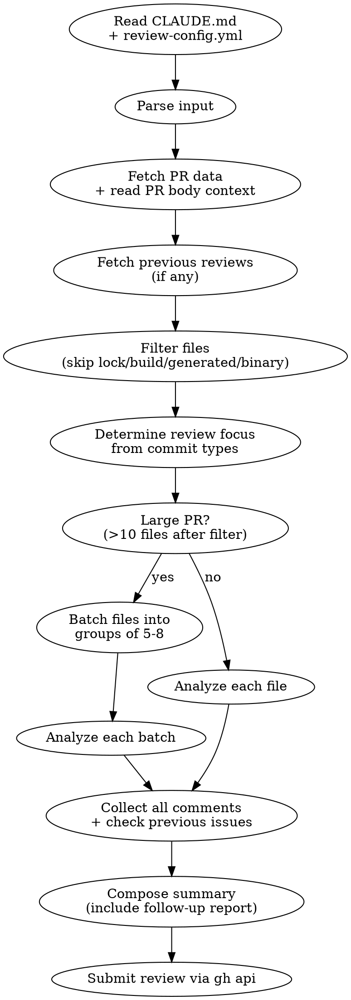

# Review Pull Request

Create GitHub PR reviews with inline line-level comments and a structured summary. Reviews are **scope-based** — focus adapts based on commit types (fix, feat, refactor, etc.).

## CI Rules (IMPORTANT)

These rules apply to **all steps** when running in CI/CD:

- Do NOT use shell redirects (`>`), pipes (`|`), chains (`&&`/`||`), or command substitution (`$(cmd)`).
- One simple command per Bash call. No shell operators at all.
- Do NOT put multi-line strings in Bash command arguments — the `*` glob in allowedTools does NOT match newlines, causing permission denials.
- To create files, use the **Write** tool instead of `cat`/`echo` with redirects.
- To read command output, run the command alone and remember the output for the next step.
- **ALWAYS** use the Write tool + `gh api --input` pattern for submitting reviews. NEVER use `gh api --field body='...'` or `gh pr review --body '...'` with inline body text.

## Project Context Discovery

Before starting the review, **read project-level instructions** to understand repo-specific rules:

1. **Check for `CLAUDE.md`** at repo root — this contains architecture rules, conventions, and constraints specific to this project. Follow these rules strictly when reviewing.
2. **Check for `.claude/review-config.yml`** — per-repo review overrides (ignore patterns, include patterns, extra rules).
3. **Auto-detect tech stack** from file extensions in the PR (`.ex`/`.exs` = Elixir, `.ts`/`.tsx` = TypeScript, `.vue` = Vue.js, `.go` = Go, `.py` = Python, `.dart` = Dart, etc.) and adapt review focus accordingly.

If `CLAUDE.md` exists, its rules take priority over generic best practices.

## Process



### Step 0: Read Project Rules

Before anything else:
```
1. Read CLAUDE.md (if exists) — extract architecture rules, naming conventions, constraints
2. Read .claude/review-config.yml (if exists) — extract ignore/include patterns, extra rules
3. These rules apply to ALL subsequent steps
```

### Step 1: Parse Input

```bash
# From URL: extract owner, repo, number
# https://github.com/org/repo/pull/123 -> org repo 123

# From number only (must be in repo directory):
# 123 -> uses current repo context
```

If user provides a URL, extract `owner/repo` and PR number. If only a number, rely on current directory git context.

### Step 2: Fetch PR Data & Context

```bash
# Metadata + head SHA (needed for review API)
gh pr view <NUMBER> --json files,commits,headRefOid,baseRefName,title,body [--repo owner/repo]

# Full diff — for large PRs, fetch per-file diffs instead
gh pr diff <NUMBER> [--repo owner/repo]
```

**Use PR body as review context.** The PR body follows this convention:
```
## What happened?
Summary of changes (bullet points). REQUIRED.

## Insights
Helpful context for reviewers. OPTIONAL.
```

Read the PR `body` field carefully before analyzing code:
- **What happened?** tells you the author's intent — use this to verify the code actually achieves what's described
- **Insights** gives context that may not be obvious from the diff (e.g., "old parsing logic removed because data structure changed")
- If PR body is empty or missing sections, note it as a Minor issue in the review

**Large diffs (>500 lines):** Don't try to read the entire diff at once. Instead:
1. Use `gh pr diff <N> --name-only` to list changed files
2. Fetch diffs per file using `gh api repos/{owner}/{repo}/pulls/<N>/files` to get patch per file
3. Apply file filtering (Step 3) before fetching diffs to save tokens

### Step 2b: Fetch Previous Reviews (Re-review Support)

Check if this PR already has review comments from a previous review session.

**Step 2b-1: Fetch existing review comments:**
```bash
gh api repos/{owner}/{repo}/pulls/<NUMBER>/comments --jq '[.[] | {id, path, line, body, created_at, user: .user.login, in_reply_to_id}]'
```

**Step 2b-2: Fetch reply threads for each review comment:**
```bash
gh api repos/{owner}/{repo}/pulls/<NUMBER>/comments --jq '[.[] | select(.in_reply_to_id != null) | {id, in_reply_to_id, body, user: .user.login}]'
```

Group replies by `in_reply_to_id` to reconstruct conversation threads.

**Step 2b-3: Process previous comments with replies:**

For each previous review comment:
1. Parse the comment — extract file path, line number, severity badge, and issue description
2. Check if there are **replies from the PR author** that dispute or explain the comment
3. If author replied with a rebuttal/explanation:
   - Read the rebuttal carefully and evaluate whether the original review comment was **correct** or **incorrect**
   - If the rebuttal is valid (reviewer was wrong): classify as **Withdrawn** — do NOT repeat the same issue
   - If the rebuttal is debatable: classify as **Discussed** — acknowledge the author's point in the follow-up
   - If the rebuttal is incorrect (reviewer was right): classify as **Unresolved** with a note referencing the discussion
4. If no replies exist, check against current code:
   - **Resolved**: code changed and issue addressed
   - **Unresolved**: code unchanged or issue persists
   - **Outdated**: file/line no longer in diff

**Key principle:** When the PR author provides a valid technical rebuttal to a review comment, **accept the feedback and don't repeat the mistake.** Review accuracy is more important than consistency.

**If no previous comments:** Skip this step and proceed with a fresh review.

### Step 3: Filter Files (Token Optimization)

**Apply BEFORE reading any diffs.** Filter the file list from Step 2 to skip irrelevant files.

**Default skip patterns (always applied):**

| Category | Patterns |
|----------|----------|
| Lock files | `*.lock`, `package-lock.json`, `yarn.lock`, `pnpm-lock.yaml`, `Podfile.lock`, `Gemfile.lock` |
| Build/output | `build/`, `dist/`, `_build/`, `deps/`, `node_modules/`, `.next/`, `.dart_tool/` |
| Generated code | `*.g.dart`, `*.freezed.dart`, `*.generated.*`, `*.gen.*`, `*.mocks.dart`, `generated/`, `__generated__/` |
| Assets/binary | `*.png`, `*.jpg`, `*.gif`, `*.svg`, `*.ico`, `*.woff`, `*.ttf`, `*.eot`, `*.mp4`, `*.mp3` |
| IDE/config | `.idea/`, `.vscode/`, `*.iml`, `.elixir_ls/` |
| Versioning | `pubspec.lock`, `*.sum`, `*.resolved` |
| Deletion-only files | Files with `additions: 0` — nothing new to review |

**Per-repo overrides** from `.claude/review-config.yml` merge with defaults:
```yaml
review:
  ignore_patterns:          # Added to defaults
    - "assets/vendor/*"
    - "priv/static/*"
  include_patterns:         # Force-include despite defaults
    - "lib/generated/important_config.dart"
  extra_rules:              # Additional review criteria
    - "Custom rule from project"
```

**Implementation:** Filter file list before fetching diffs:
```bash
# Get files with additions count to skip deletion-only
gh pr view <N> --json files --jq '.files[] | select(.additions > 0) | .path'
```
Then apply pattern matching to skip default + config patterns. Only fetch diffs for remaining files.

### Step 4: Determine Review Focus

Parse commit messages and apply scope-based review:

| Commit Type | Review Focus |
|-------------|-------------|
| `fix:` | Root cause solved? Regression risk? Edge cases? Test for the bug? |
| `feat:` | Design/architecture sound? Follows existing patterns? Breaking changes? |
| `refactor:` | Behavior preserved? Actually cleaner? No mixed-in feature changes? |
| `chore:` | Config correct? Security implications? |
| `test:` | Tests meaningful? Not testing implementation details? |
| `perf:` | Measurable? Tradeoffs acceptable? |

Mixed commit types: apply relevant focus per file.

### Step 5: Deep Analysis (CRITICAL — do NOT skip)

Shallow diff reading produces shallow reviews. **You MUST investigate the surrounding codebase** before forming opinions.

#### 5a: Trace all callers of modified functions

For every function whose **behavior changed** (not just new functions), use Grep to find all call sites.

**Why:** A function may have multiple callers. Changing behavior (e.g., removing a conditional, adding a side effect) affects ALL callers, not just the new code path.

**What to look for:**
- Does a caller already do something the modified function now also does? (double execution)
- Does any caller depend on the old behavior? (regression)
- Is the function called in a hot path where new side effects matter? (performance)

#### 5b: Read infrastructure/utility implementations

When the PR uses a framework function, shared utility, or library call, **read its implementation** to understand:
- **Deduplication/conflict behavior**: Does it upsert or create duplicates? What's the unique key?
- **Error handling**: Does it raise, return error tuples, or silently fail?
- **Side effects**: Does it trigger callbacks, enqueue jobs, send notifications?

**Never assume** how a utility works — grep for its definition and read it.

#### 5c: Check for stale data in async/scheduled contexts

When code stores data in a payload consumed **later** (cron tasks, job queues, message queues):
1. Can the stored data change between creation and execution time?
2. Can other code paths modify the same data concurrently?
3. Should the worker read fresh data at execution time instead of using the stored value?

#### 5d: Verify edge cases in arithmetic/time calculations

When the PR does arithmetic with values from external sources (APIs, user input, DB):
1. Can the input be nil/null/undefined?
2. Can the result be negative, zero, or unexpectedly large?
3. What are the boundary values?

Provide concrete guard suggestions, not just "add a nil check."

#### 5e: Check for orphaned/leaked resources

When the PR creates resources (scheduled tasks, background processes, DB records):
1. Is the old resource cleaned up when a new one is created?
2. What happens if the lookup key changes between calls? (orphaned duplicates)
3. Is there a cleanup path when the feature is disabled/removed?

#### 5f: Verify error path continuity

For features that self-schedule (task creates next task) or chain operations:
1. What happens if execution fails? Does the chain break silently?
2. Is there a retry or re-schedule on error?
3. Are all error branches handled?

#### 5g: Apply CLAUDE.md rules

If the project has a `CLAUDE.md`, cross-check every changed file against its rules. Common project-specific concerns:
- Database sharding constraints (e.g., distribution columns in queries/joins)
- Required function signatures (e.g., tenant ID as first argument)
- Architecture boundaries (e.g., no direct DB calls in controllers)
- Response format requirements
- Naming conventions

Flag violations as **Major** if they break architecture invariants, **Minor** if they break conventions.

### Step 6: Analyze Changed Files

For each file that passed Step 3 filtering:
1. Read the diff hunks carefully
2. Apply deep analysis findings from Step 5
3. Identify issues based on review focus (Step 4) + CLAUDE.md rules (Step 5g) + any `extra_rules` from config

**CRITICAL RULES:**
- Only comment on lines that appear in the diff hunks. Lines outside hunks cause **422 Validation Failed** from GitHub API.
- Use `line` (the actual source line number in the file, NOT the diff position) + `side: "RIGHT"` for new/changed lines.
- Use `line` + `side: "LEFT"` only for commenting on deleted lines.
- For multi-line comments, use `start_line` + `start_side` + `line` + `side`.

**How to get correct line numbers from diff:**
- Diff hunk headers look like: `@@ -oldStart,oldCount +newStart,newCount @@`
- For `side: "RIGHT"` (new file), count from `newStart` in the `+` column
- For `side: "LEFT"` (old file), count from `oldStart` in the `-` column
- For **new files** (all `+` lines): line numbers start at 1, every `+` line increments
- For **modified files**: use the `@@` header to determine the starting line number, then count only `+` and context (space) lines for RIGHT side

For **large PRs** (>10 files after filtering): batch files into groups of 5-8 and analyze each group separately to manage context. Collect all comment objects before composing the summary.

### Step 7: Compose Review Comments

**Every comment MUST include:**
1. **Severity badge** (Major/Minor/Nitpick)
2. **Clear description** — not just "this could be a problem" but exactly what goes wrong and under what conditions
3. **Evidence from codebase investigation** — reference the caller, the utility implementation, or the data flow you traced in Step 5
4. **Concrete fix suggestion** — provide actual code, not just "consider handling this"

**Bad comment (vague):**
> This value might be nil, which could cause issues.

**Good comment (specific + evidence + fix):**
> `expire_in` comes from the external API response. If the field is missing or nil, the arithmetic on line N crashes. Additionally, values smaller than the buffer (86400) would schedule in the past. Add a guard: `max((expire_in || 0) - 86400, 3600)`

**Bad comment (surface-level):**
> This changes behavior for all callers.

**Good comment (traced impact):**
> Removing the conditional means `save_token` now runs on every call. `TokenManager.refresh/2` (line N) already calls `save_token` after this function — so now it executes twice per refresh. This is likely idempotent, but the original guard may have existed for a reason. Was this intentional?

### Step 8: Submit Review

**IMPORTANT: No shell operators (redirects `>`, pipes `|`, chains `&&`). Use the Write tool for creating files.**

**Step 8a: Get commit SHA** (Bash call):
```bash
gh pr view <NUMBER> --json headRefOid -q '.headRefOid'
```
Save the output as COMMIT_SHA for the next step.

**Step 8b: Write review JSON** (use Write tool, NOT Bash):
Use the **Write** tool to create `/tmp/review.json`:
```json
{
  "commit_id": "<COMMIT_SHA from step 8a>",
  "body": "## PR Review Summary\n\n...",
  "event": "COMMENT",
  "comments": [
    {
      "path": "relative/path/to/file",
      "line": 42,
      "side": "RIGHT",
      "body": "Description."
    }
  ]
}
```

**Step 8c: Submit** (Bash call):
```bash
gh api repos/{owner}/{repo}/pulls/<NUMBER>/reviews --method POST --input /tmp/review.json
```

**Step 8d: Cleanup** (Bash call):
```bash
rm /tmp/review.json
```

## Inline Comment Format

Use severity badge images on a **separate line**:

**Severity badges (copy exactly):**
- Major: ``
- Minor: ``
- Nitpick: ``

**Inline comment examples:**

```


Null safety issue — `data` can be undefined when API returns error response.

```suggestion
const value = data?.result ?? defaultValue;
```
```

```


This filtering should be pushed to the query layer for performance — currently fetching all records then filtering in memory.
```

```


Function name doesn't follow project naming convention from CLAUDE.md.
```

With suggestion block:
```


Description of the issue.

\`\`\`suggestion
fixed code here
\`\`\`
```

Only 3 severity levels:
-  — bugs, security vulnerabilities, data loss, breaking changes, CLAUDE.md architecture violations
-  — design issues, missing error handling, potential regressions, readability
-  — style preferences, naming, minor suggestions, optional improvements

## Expected Actions per Severity

| Severity | PR Author Should | Reviewer Expectation |
|----------|-----------------|---------------------|
|  | **Must fix** before merge | Block merge until resolved |
|  | **Should fix** or explain why not | Prefer fix, but accept justification |
|  | **Optional** — fix if easy, skip if not | No action required, just awareness |

## Summary Review Format

```markdown
## PR Review Summary

**Type**: fix | feat | refactor | ...
**Files reviewed**: N | **Issues found**: N major, N minor, N nitpick

### Findings
1.  Brief description (`file:42`)
   - *Evidence*: traced caller X which already does Y, causing double execution
2.  Brief description (`file:15`)
   - *Evidence*: external API may omit field Z, causing crash
3.  Brief description (`file:8`)

### Previous Review Follow-up
> Only include this section if previous review comments were found (Step 2b).

| Status | File | Issue |
|--------|------|-------|
| :white_check_mark: Resolved | `auth.dart:42` | Null safety issue |
| :x: Unresolved | `api.dart:15` | Missing error handling |
| :grey_question: Outdated | `old_file.dart:8` | File no longer in diff |
| :arrows_counterclockwise: Withdrawn | `config.yml:10` | Author rebuttal accepted — original comment was incorrect |
| :speech_balloon: Discussed | `service.dart:25` | Author provided justification, acknowledged |

**Resolved: 2/5 | Withdrawn: 1/5 | Discussed: 1/5 | Unresolved: 1/5**

### Positive Notes
- Good test coverage for edge cases
- Clean separation of concerns

### Recommendation
LGTM | Minor changes needed | Significant changes needed

---
*Reviewed by Claude Code*
```

If no issues found, submit a positive review:

```markdown
## PR Review Summary

LGTM! No issues found.

**Files reviewed**: N
**Type**: feat

### Positive Notes
- Well-structured implementation
- Good test coverage

---
*Reviewed by Claude Code*
```

## CI/CD Integration

### Avoid duplicate reviews

Before submitting, check if this commit was already reviewed:

```bash
COMMIT_SHA=$(gh pr view $PR_NUMBER --json headRefOid -q '.headRefOid')
EXISTING=$(gh api repos/{owner}/{repo}/pulls/$PR_NUMBER/reviews \
  --jq "[.[] | select(.commit_id == \"$COMMIT_SHA\" and .user.login == \"github-actions[bot]\")] | length")

if [ "$EXISTING" -gt "0" ]; then
  echo "Already reviewed this commit, skipping."
  exit 0
fi
```

### Skip conditions

Skip review when:
- PR author is a bot (e.g., dependabot, renovate)
- PR is a draft
- PR only changes ignored file patterns

## Common Mistakes

| Mistake | Fix |
|---------|-----|
| Comment on line outside diff | Verify line is within a diff hunk before adding comment |
| Wrong `commit_id` | Always fetch HEAD SHA with `gh pr view --json headRefOid` |
| Variable in single-quoted heredoc | Use `EOF` without quotes or construct JSON with `jq` |
| Missing `--repo` flag | Required when reviewing PRs from outside the repo directory |
| Reviewing generated files | Check `ignore_patterns` in repo config first |
| Duplicate reviews on re-push | Check existing reviews for same commit before submitting |
| Reviewing bot/draft PRs | Skip with early exit based on PR metadata |
| Re-reviewing without checking old comments | Always fetch previous review comments (Step 2b) on re-review |
| Marking issue as resolved without verifying | Check that the code actually changed AND the issue is addressed |
| Shallow diff-only review | ALWAYS trace callers of modified functions and read utility implementations (Step 5) |
| Vague comments without evidence | Every comment must reference traced code: callers, implementations, data flows |
| Assuming utility/library behavior | Read the actual implementation — never guess dedup keys, error handling, etc. |
| Missing stale data in async contexts | When data is stored for later consumption, verify it won't be stale at execution time |
| No concrete fix suggestion | Provide actual code, not just "consider handling this" |
| Ignoring CLAUDE.md rules | ALWAYS read and enforce project-specific rules from CLAUDE.md |
