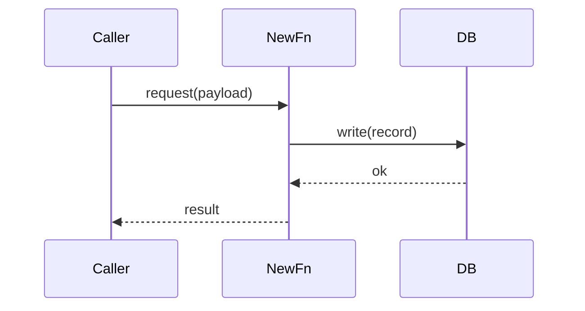

# Review Pull Request

Create GitHub PR reviews with inline line-level comments and a structured summary. Reviews are **scope-based** — focus adapts based on commit types.

## Review Philosophy (read first — governs every finding)

**Precision over recall.** A false positive costs more reviewer trust than a missed minor issue. When unsure and impact is low, stay silent. Leading reviewers (Cursor BugBot, Graphite Diamond, Greptile) optimize *resolution rate* (did the author act on the comment?), not comment count — a clean, high-signal review of 3 real bugs beats 15 speculative nits. **Finding nothing report-worthy is an acceptable, even good, outcome.**

**Confidence gating.** Every candidate finding carries an internal confidence 0–100 (how sure you are it's a real defect that reaches the buggy line):
- **Major (bug/security/data-loss):** report at ≥70. Below 70, report ONLY if impact is severe (data loss, security, corruption) AND the comment explicitly states what remains uncertain.
- **Minor:** report at ≥80.
- **Nitpick:** report at ≥90, and only if it's not in the Do-Not-Flag list (Step 7).
- Anything below its bar → drop silently. Rarity affects priority, not severity — never downgrade a reproducible bug to Nitpick.

**Evidence or silence.** Any claim about code outside the diff (a caller, a utility's behavior, a missing handler) must be backed by an actual grep/read you performed. No receipt → downgrade to a question or drop it. Never guess at behavior you can verify.

## CI Rules (IMPORTANT — applies to ALL steps)

- No shell redirects (`>`), pipes (`|`), chains (`&&`/`||`), or command substitution (`$(cmd)`).
- One simple command per Bash call.
- Do NOT put multi-line strings in Bash command arguments.
- Use **Write** tool (not `cat`/`echo`) to create files.
- **ALWAYS** use Write tool → `/tmp/review.json` → `gh api --input` for submitting reviews. NEVER use inline body text with `gh api --field` or `gh pr review --body`.
- **Parallel tool calls**: when reading multiple independent files (CLAUDE.md + review-config.yml + README, or N source files traced from Step 5), issue ALL Read calls in a single message. Sequential reads waste turns.

## Pre-fetched Context (use this first, skip redundant `gh` calls)

The runner pre-fetches PR data into `/tmp/pr-context/` before invoking you:

| File | Contents | Replaces |
|------|----------|----------|
| `pr-meta.json` | `files`, `commits`, `headRefOid`, `baseRefName`, `title`, `body`, `author`, `isDraft` | Step 2 `gh pr view --json ...` |
| `pr-diff.patch` | Full unified diff | Step 2 `gh pr diff` |
| `pr-comments.json` | Previous review comments (array of `{id, path, line, body, created_at, user, in_reply_to_id}`) | Step 2b `gh api .../pulls/N/comments` |

**Always Read these three files in parallel as your first action.** Only fall back to `gh` calls if a file is missing/empty, or if you need data not in the pre-fetched set (e.g. per-file diffs for huge PRs).

## Step 0: Build Project Context

Gather context in priority order. **Issue all Reads in a single message (parallel)** — do not chain them sequentially:

1. **Read `CLAUDE.md`** at repo root → extract architecture rules, naming conventions, constraints
2. **Read `.claude/review-config.yml`** → extract ignore/include patterns, `extra_rules`, `path_instructions` (glob → focus rules), and `suppress_rules` (findings the team has declared off-limits — **honor these unconditionally**, they override everything below)
3. **If neither exists**, auto-discover (also parallel where possible):
   - Read `README.md` for project overview
   - Detect stack from config files (`mix.exs`, `package.json`, `go.mod`, `Cargo.toml`, `pyproject.toml`, `pubspec.yaml`, `Gemfile`, `pom.xml`/`build.gradle`)
   - Check linter configs (`.eslintrc*`, `.rubocop.yml`, `.golangci.yml`, `credo.exs`, `ruff.toml`)
   - Scan 2-3 existing source files to understand code style

**Priority**: `CLAUDE.md` > `review-config.yml` extra_rules > auto-detected conventions > generic best practices.

**No CLAUDE.md?** Apply universal rules: security (injection, auth bypass, secrets), correctness (null safety, off-by-one, race conditions), performance (N+1, unbounded loops, memory leaks), maintainability (dead code, duplication, unclear naming), concurrency (data races, deadlocks).

## Step 1: Parse Input

Extract `owner/repo` and PR number from URL or use current directory git context.

## Step 2: Fetch PR Data

**Primary source:** Read `/tmp/pr-context/pr-meta.json` (metadata) and `/tmp/pr-context/pr-diff.patch` (diff). These are pre-fetched — no `gh` call needed.

**Fallback only if pre-fetched files are missing:**
```bash
gh pr view <NUMBER> --json files,commits,headRefOid,baseRefName,title,body [--repo owner/repo]
gh pr diff <NUMBER> [--repo owner/repo]
```

**PR body as context:** Read `What happened?` (author's intent) and `Insights` (non-obvious context) before analyzing code. Empty PR body = Minor issue.

**Large diffs (>500 lines):** If `pr-diff.patch` is excessive, ignore it and fetch per-file via `gh api repos/{owner}/{repo}/pulls/<N>/files`. Filter (Step 3) before fetching diffs.

### Step 2b: Re-review Support

**Primary source:** Read `/tmp/pr-context/pr-comments.json` (pre-fetched array of previous review comments). If file is empty (`[]`), skip this step.

**Fallback only:**
```bash
gh api repos/{owner}/{repo}/pulls/<NUMBER>/comments --jq '[.[] | {id, path, line, body, created_at, user: .user.login, in_reply_to_id}]'
```

For each previous comment, classify based on replies and current code state:
- **Resolved**: code changed, issue addressed
- **Unresolved**: code unchanged or issue persists
- **Outdated**: file/line no longer in diff
- **Withdrawn**: author rebuttal was valid — do NOT repeat the issue
- **Discussed**: debatable — acknowledge author's point in follow-up

**Key principle:** When PR author provides a valid technical rebuttal, accept it. Review accuracy > consistency.

**Incremental scoping (when previous comments exist):** Concentrate fresh deep-analysis on commits/hunks added *since the latest comment's `created_at`*. Only re-touch older code if a new change altered its inputs or contracts. This mirrors how CodeRabbit/BugBot do incremental reviews — don't re-review the whole PR from scratch each push.

**Dedup (mandatory):** Before adding any inline comment, check it against `pr-comments.json`. Never re-post a finding already raised at the same `path`+`line` (even if unresolved — it's already visible). Surface still-open prior issues in the "Previous Review Follow-up" table instead, not as new inline comments.

**No previous comments?** Skip this step.

## Step 3: Filter Files (Token Optimization)

Apply BEFORE reading any diffs. Skip these patterns:

| Category | Patterns |
|----------|----------|
| **Lock files** | `*-lock.*`, `*.lock`, `*.lockb`, `go.sum` |
| **Build/output** | `build/`, `dist/`, `out/`, `target/`, `_build/`, `deps/`, `node_modules/`, `.next/`, `.nuxt/`, `.output/`, `.dart_tool/`, `__pycache__/`, `.tox/`, `vendor/` |
| **Generated** | `*.generated.*`, `*.gen.*`, `*.g.dart`, `*.freezed.dart`, `*.pb.*`, `*_pb2.py`, `*.swagger.*`, `*.openapi.*`, `generated/`, `__generated__/`, `*.graphql.ts`, `*.graphql.dart` |
| **Assets/binary** | Images, fonts, media, archives (`*.png`, `*.jpg`, `*.woff2`, `*.mp4`, `*.pdf`, `*.zip`, etc.) |
| **IDE** | `.idea/`, `.vscode/`, `*.iml`, `.elixir_ls/`, `.DS_Store` |
| **Minified/maps** | `*.min.js`, `*.min.css`, `*.bundle.js`, `*.chunk.js`, `*.map` |
| **Snapshots** | `__snapshots__/`, `*.snap`, `fixtures/` (unless test-related) |
| **Deletion-only** | Files with `additions: 0` |

**Per-repo overrides** from `.claude/review-config.yml`:
```yaml
review:
  ignore_patterns: ["custom/path/*"]      # Added to defaults
  include_patterns: ["generated/important.ts"]  # Force-include
  extra_rules: ["Custom review rule"]
  # Glob → extra focus for matching files (e.g. authz checks on controllers)
  path_instructions:
    - path: "**/controllers/**"
      instructions: "Verify authorization and input validation on every action."
  # Findings the team has declared off-limits — NEVER post these (kills recurring false positives)
  suppress_rules:
    - "Don't flag naming/style nits."
    - "We use stateless JWT — skip CSRF concerns."
```

Filter implementation:
```bash
gh pr view <N> --json files --jq '.files[] | select(.additions > 0) | .path'
```

## Step 4: Determine Review Focus

| Commit Type | Focus |
|-------------|-------|
| `fix:` | Root cause solved? Regression risk? Edge cases? Test for bug? |
| `feat:` | Design sound? Follows patterns? Breaking changes? |
| `refactor:` | Behavior preserved? Actually cleaner? No mixed-in features? |
| `chore:` | Config correct? Security implications? |
| `test:` | Tests meaningful? Not testing implementation details? |
| `perf:` | Measurable? Tradeoffs acceptable? |

## Step 5: Deep Analysis (CRITICAL — do NOT skip)

**You MUST investigate the surrounding codebase before forming opinions.** Shallow diff-only reading is the #1 cause of low-quality reviews. Every sub-step below is mandatory when applicable.

**Adversarial mindset:** Assume every diff hides at least one bug — your job is to find it or prove it absent. Never judge code by appearance ("looks correct"). For each changed function, mentally execute it line by line with concrete values: one happy-path input, one boundary input (empty/zero/first/last), and one failure-path input (error return, nil, timeout). A bug you can trigger with a named input is a finding; "this looks fine" is not a verification.

**5a: Trace callers** — For every function whose behavior changed, Grep all call sites. Check for: double execution, callers depending on old behavior, performance impact in hot paths.

**5b: Read implementations** — When PR uses framework functions/utilities/library calls, read their source. Check: dedup/conflict behavior, error handling, side effects. **Never assume** — grep and read.

**5c: Stale data in async contexts** — For data stored in payloads consumed later (cron, queues, delayed events): can it change between creation and execution? Should the worker read fresh data instead?

**5d: Arithmetic/time edge cases** — Can input be nil/NaN? Can result be negative/zero/huge? Provide concrete guards, not just "add a nil check."

**5e: Orphaned resources** — When PR creates resources (tasks, subscriptions, timers, records): is the old one cleaned up? What if lookup key changes? Is there cleanup when feature is disabled?

**5f: Error path continuity** — For self-scheduling features or chained operations: what happens on failure? Does the chain break silently? Is there retry/re-schedule?

**5g: Project-specific rules** — If CLAUDE.md exists, cross-check every changed file. If not, infer conventions from 2-3 similar existing files. Only flag clear inconsistencies, focus on universal issues.

**5h: Logic & control flow** — For every changed conditional, loop, or guard, check: inverted/wrong operators (`&&` vs `||`, `<` vs `<=`, negation errors), off-by-one in indices/pagination/slicing, early returns that skip cleanup or release, switch/case fallthrough or missing default, branches that can never execute, and loop exit conditions that can never be met. Trace concrete values through each branch — including the branch the diff did NOT change but whose inputs changed.

**5i: State & data consistency** — For multi-step writes (record + cache, DB + event, file + index): what if step 2 fails after step 1 succeeded? Is the operation idempotent when retried? Are invariants between related fields preserved (status ↔ timestamp, count ↔ collection, flag ↔ data presence)? Is stale cache/derived data invalidated when the source changes?

**5j: Contract & compatibility drift** — When a signature, return shape, nullability, default value, enum, or serialized format changes: do ALL callers and consumers handle the new contract? Grep for the old name/key — renamed or removed fields silently produce nil/undefined downstream. Can in-flight old data (queued jobs, persisted rows, clients on the previous version) still flow through the new code?

**5k: Concurrency & duplicate execution** — Check-then-act gaps (`exists?` → `create`), non-atomic read-modify-write on shared state, the same message/event processed twice under at-least-once delivery, and missing locks or uniqueness constraints where parallel execution is possible. Ask: what happens if two instances of this code run at the same time?

## Step 6: Analyze Changed Files

For each file passing Step 3 filter: read diff hunks, apply Step 5 findings, identify issues per Step 4 focus + project rules + `extra_rules`.

**Falsification pass (before declaring a file clean):** for each changed function, name the input or sequence of events you tried to break it with (per Step 5h–5k). Only mark a file clean after the boundary and failure paths survive mental execution — not after a single happy-path read.

**Line number rules (CRITICAL):**
- Only comment on lines within diff hunks — lines outside cause **422 Validation Failed**
- Use `line` (source line number, NOT diff position) + `side: "RIGHT"` for new/changed lines
- Use `side: "LEFT"` only for deleted lines
- For multi-line: use `start_line` + `start_side` + `line` + `side`
- Diff header `@@ -oldStart,oldCount +newStart,newCount @@`: count from `newStart` for RIGHT, `oldStart` for LEFT

**Parallel reads:** When opening multiple source files (callers from Step 5a, implementations from Step 5b, sibling files for convention check), issue all Read calls in a single message.

**Large PRs (>10 files):** Batch into groups of 5-8, collect all comments before composing summary.

## Step 6.5: Self-Critique Pass (generate → filter — do NOT skip)

You now have a list of *candidate* findings. Re-read them with a fresh, skeptical eye, as if a second reviewer were auditing your work for false positives. This separate filtering pass is the single highest-impact noise control used by every leading tool (BugBot's validator model, Greptile's self-challenge, CodeRabbit's verification lane, Anthropic's per-finding filter). For **each** candidate:

1. **Trace the trigger.** Confirm the concrete input/sequence you claim actually reaches the buggy line — re-grep the call path if needed. If you cannot trace a real path to the defect, **drop it**.
2. **Check the receipt.** Every cross-file claim (caller behavior, utility semantics, missing handler) must cite a grep/read you actually did. No receipt → downgrade to a question or drop.
3. **Score confidence 0–100** and apply the Review Philosophy gate (Major ≥70, Minor ≥80, Nitpick ≥90). Below the bar → drop, unless severe-impact escape clause applies.
4. **Apply `suppress_rules`** from review-config.yml and the Do-Not-Flag list (Step 7). Matching candidate → drop.
5. **Dedup** against already-posted comments (Step 2b).

Dropping most or all candidates here is normal and correct. Keep only findings you would defend out loud with a named reproduction.

## Step 7: Compose Review Comments

Every comment MUST have:
1. **Severity badge** (separate line)
2. **Specific description** — what goes wrong, under what conditions
3. **Trigger** — an explicit clause naming the input/state/sequence that makes it fail ("Trigger: when `items` is empty…", "Trigger: if the request retries after step 1 committed…"). If you cannot write a concrete trigger, you do not have a finding — drop it.
4. **Evidence** — reference traced callers, implementations, or data flows from Step 5
5. **Concrete fix** — actual code, not "consider handling this"

**Bad:** "This value might be nil, which could cause issues."
**Good:** "`expire_in` comes from external API. Trigger: API omits the field → `expire_in` is nil → arithmetic on line N crashes; values < buffer (86400) schedule in the past. Fix: `max((expire_in || 0) - 86400, 3600)`"

### Do-Not-Flag list (suppress these — they are noise, not signal)

Never post a comment whose sole content is one of these (learned from PR-Agent, Anthropic security-review, BugBot, Copilot):
- Missing docstrings, comments, or type hints/annotations.
- Unused imports/variables (the linter owns these).
- "Use a more specific exception type" / over-broad catch, with no concrete failure.
- Package/dependency version choices, or "this dependency is outdated."
- Pure style/naming/formatting unless a project rule mandates it OR it causes an actual defect.
- Theoretical races/edge cases with no concrete trigger you can name.
- Missing rate-limiting / DOS / resource-exhaustion hardening, unless the path is security-critical.
- Code elements that may be defined elsewhere in the codebase (grep first — don't flag "undefined" without checking).
- Test/fixture/doc-only nitpicks when the production change itself is clean.

A finding that is genuinely Major (a real bug/security hole) is never suppressed by this list — these only kill low-value noise.

### Finding budget

Rank surviving findings by **severity × confidence**. Post the top ~10–15. If more remain, post the highest and roll the rest into a single summary line ("N additional minor/nitpick items omitted for signal"). A wall of 30 comments trains the team to ignore the bot.

**Reporting threshold for potential bugs:** If you can name a concrete input, value, or sequence of events that makes the code misbehave, report it — even without running it; state the trigger condition explicitly ("when the list is empty…", "if the request retries after step 1 committed…"). Conversely, vague unease without a concrete trigger is NOT a finding — investigate further (Step 5) or drop it. Never downgrade a reproducible logic bug to Nitpick because it "probably rarely happens": rarity affects priority, not severity.

## Step 8: Submit Review

**8a** — Get commit SHA (Bash):
```bash
gh pr view <NUMBER> --json headRefOid -q '.headRefOid'
```

**8b** — Write review JSON (Write tool to `/tmp/review.json`):
```json
{
  "commit_id": "<COMMIT_SHA>",
  "body": "## PR Review Summary\n\n...",
  "event": "COMMENT",
  "comments": [
    {
      "path": "relative/path/to/file",
      "line": 42,
      "side": "RIGHT",
      "body": "Description."
    }
  ]
}
```

**8c** — Submit (Bash):
```bash
gh api repos/{owner}/{repo}/pulls/<NUMBER>/reviews --method POST --input /tmp/review.json
```

**8d** — Cleanup (Bash): `rm /tmp/review.json`

## Comment Format

**Severity badges (copy exactly):**
- `` — bugs, security, data loss, breaking changes, architecture violations
- `` — design issues, missing error handling, regressions, readability
- `` — style, naming, optional improvements

**Expected actions:** Major = must fix | Minor = should fix or justify | Nitpick = optional

**Example:**
```


Null safety — `data` can be undefined when API returns error response.

```suggestion
const value = data?.result ?? defaultValue;
```
```

## Summary Format

```markdown
## PR Review Summary

**Type**: fix | feat | refactor | ...
**Files reviewed**: N | **Issues found**: N major, N minor, N nitpick
**Review effort**: [1-5] — 1 = small & trivial, 5 = large/complex/high-risk (triage signal for the human reviewer)

### Walkthrough

Wrap this whole section in `<details><summary>Walkthrough</summary>` … `</details>` so it stays collapsed and never buries the Findings.

**Changes table (always include):** one row per changed file (or per logical group for large PRs), summarizing *what* changed — not a diff restatement.

| File(s) | Change summary |
|---------|----------------|
| `path/to/file` | One-line description of the substantive change |

**Sequence/flow diagram (ONLY when Review effort ≥ 3 OR the PR adds non-trivial control flow that spans ≥2 modules/services/layers):** emit a Mermaid block. Skip it entirely for small/simple PRs — a diagram of a one-file change is noise. Keep it to the changed control flow only; do not diagram unchanged paths. Render as a fenced ` ```mermaid ` block (GitHub renders it natively):


```mermaid
sequenceDiagram
    participant Caller
    participant NewFn
    participant DB
    Caller->>NewFn: request(payload)
    NewFn->>DB: write(record)
    DB-->>NewFn: ok
    NewFn-->>Caller: result
```

Only include arrows/participants that the diff actually touches. If a Mermaid diagram would be guessy or you can't ground every node in code you read, omit it — a missing diagram beats a wrong one. Build the review JSON with the **Write** tool (it escapes the newlines/backticks safely); never assemble the body via shell.

### Intent vs. Implementation
> Only when the PR body states intent (`What happened?`). Restate the claimed changes in your own words, then bucket each:

- ✅ Implemented: <claim that the diff actually delivers>
- ❌ Not implemented / diverged: <claim the code does not fulfill>
- ⚠️ Needs human verification: <claim you can't confirm from the diff>
- 🔎 Scope creep: <code doing things the description never mentions>

### Findings
1.  Brief description (`path/file:42`)
   - *Evidence*: traced caller X which already does Y
2.  Brief description (`path/file:15`)
3.  Brief description (`path/file:8`)

### Previous Review Follow-up
> Only if previous comments found (Step 2b).

| Status | File | Issue |
|--------|------|-------|
| :white_check_mark: Resolved | `file:42` | Description |
| :x: Unresolved | `file:15` | Description |
| :arrows_counterclockwise: Withdrawn | `file:10` | Author rebuttal accepted |

**Resolved: N/N | Withdrawn: N/N | Unresolved: N/N**

### Positive Notes
- Notable good practices

### Recommendation
LGTM | Minor changes needed | Significant changes needed

---
*Reviewed by Claude Code*
```

If no issues: `LGTM! No issues found.` + files reviewed count + positive notes.

## Common Mistakes

| Mistake | Fix |
|---------|-----|
| Comment on line outside diff | Verify line is within diff hunk |
| Wrong `commit_id` | Always fetch HEAD SHA with `gh pr view --json headRefOid` |
| Missing `--repo` flag | Required when outside the repo directory |
| Shallow diff-only review | ALWAYS trace callers + read implementations (Step 5) |
| Vague comments without evidence | Reference traced code: callers, implementations, data flows |
| Assuming utility behavior | Read actual implementation — never guess |
| No concrete fix suggestion | Provide actual code |
| Only checking the happy path | Mentally execute boundary + failure inputs (Step 5h) |
| Judging code by appearance ("looks correct") | Trace concrete values through every changed branch |
| Missing cross-file contract breaks | Grep old names/keys after signature or shape changes (Step 5j) |
| Ignoring retry/parallel execution | Ask what happens when the code runs twice (Step 5i/5k) |
| Posting low-confidence speculation | Apply the confidence gate (Major ≥70 / Minor ≥80 / Nitpick ≥90); drop the rest (Step 6.5) |
| Flagging noise (docstrings, naming, unused imports) | Check the Do-Not-Flag list (Step 7) before posting |
| Re-posting a comment from a prior review | Dedup against `pr-comments.json`; use the follow-up table (Step 2b) |
| Skipping the self-critique pass | Always re-audit candidates for false positives before submitting (Step 6.5) |
| Burying real bugs under 30 nitpicks | Rank by severity × confidence, cap at ~10-15, summarize the rest (Step 7) |
